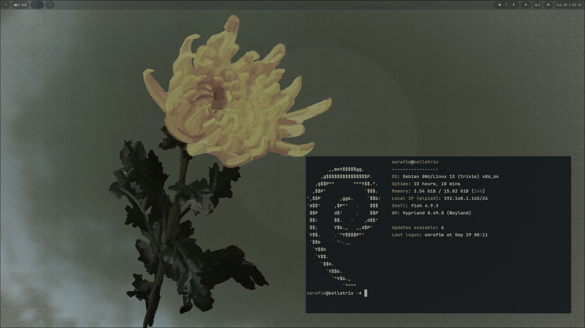
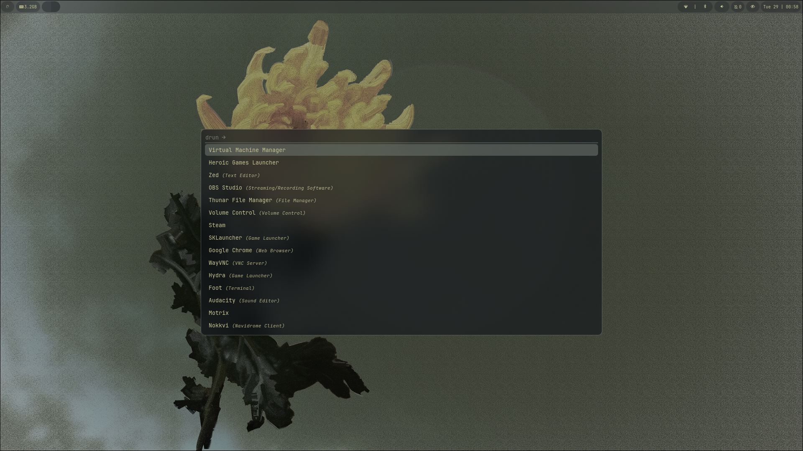
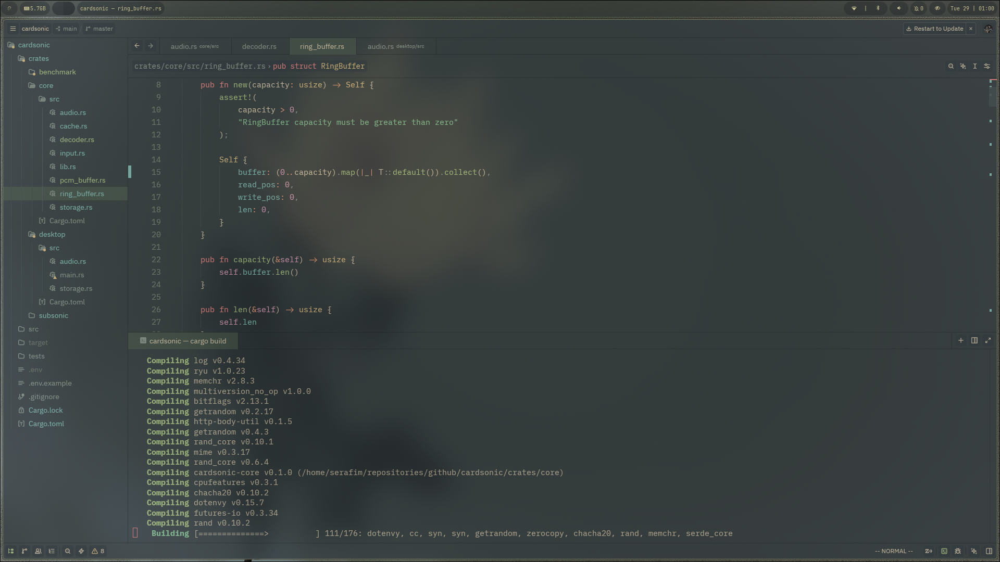

# My Hyprland rice on Debian

An Infrastructure as Code (IaC) repository for my custom Hyprland setup on Debian, featuring fully automated system restoration using GNU Stow and Bash scripts.

---

## Quick Start (Automated Installation)

After a fresh Debian installation, clone this repository and run the bootstrap script to automatically install APT packages, restore dotfiles, and set up the Fish shell:

```bash
git clone https://github.com/omifares/dotfiles.git ~/dotfiles
cd ~/dotfiles
chmod +x install.sh
./install.sh

```

---

## Infrastructure & Management

This repository uses **GNU Stow** to manage dotfiles as symlinks pointing to `$HOME`.

* **Dotfiles Structure:** Each tool has its own directory mirroring the target path (`<app>/.config/<app>`).
* **Package Management:** System dependencies and applications are declared in `packages/apt-packages.txt`.
* **Updating Dotfiles:** Any changes made inside `~/dotfiles/<app>/.config/<app>` reflect instantly in your system due to symlinks.

---

## Tools & Stack

* **Window Compositor:** [Hyprland](https://www.google.com/search?q=https://wiki.hyprland.org/)
* **Dotfile Manager:** [GNU Stow](https://www.google.com/search?q=https://www.gnu.org/software/stow/)
* **Color Engine:** [Wallust](https://crates.io/crates/wallust) (dynamic color palettes from wallpaper)
* **Wallpaper Daemon:** [SWWW](https://github.com/LGFae/swww)
* **Bar & Notifications:** [Waybar](https://www.google.com/search?q=https://github.com/Alexays/Waybar) & [SwayNC](https://www.google.com/search?q=https://github.com/ErikReider/SwayNotificationCenter)
* **Terminal & Shell:** [Kitty](https://www.google.com/search?q=https://sw.kovidgoyal.net/kitty/) & [Fish Shell](https://www.google.com/search?q=https://fishshell.com/)
* **Editor:** [Neovim](https://www.google.com/search?q=https://neovim.io/) & [Zed](https://www.google.com/search?q=https://zed.dev/)
* **Font:** [JetBrains Nerd Font](https://www.google.com/search?q=https://github.com/ryanoasis/nerd-fonts)
* **Audio & Media:** Pipewire & Playerctl

---

## ⌨️ Keybinds

| Key | Action |
| --- | --- |
| `Super + X` | Rofi (App selector) |
| `Super + V` | Clipse (Clipboard history) |
| `Super + G` | Google Chrome |
| `Super + Q` | Kitty terminal |
| `Super + W` | Wallpaper selection |
| `Super + T` | Waybar theme selection |
| `Super + N` | Notifications panel |
| `Super + F12` | Wlogout (Power menu) |

### Window & Workspace Management

| Key | Action |
| --- | --- |
| `Super + Arrows` | Change focus |
| `Super + Space` | Kill active window |
| `Super + [0-9]` | Switch workspace |
| `Super + Shift + [0-9]` | Move active window to workspace |
| `Super + Shift + Arrows` | Move active window |
| `Super + Alt + Arrows` | Resize active window |
| `Super + F` | Toggle float |
| `Super + Shift + F` | Toggle fullscreen |
| `Super + P` | Toggle pseudo float |
| `Super + J` | Toggle split |

### Media Keys

| Key | Action |
| --- | --- |
| `Fn + Audio Play` | Toggle play/pause |
| `Fn + Audio Mute` | Toggle mute |
| `Fn + Audio Next` | Next track |
| `Fn + Audio Prev` | Previous track |
| `Fn + Vol Up / Down` | Volume control |

---

### Demos

<details>
  <summary>📸 <b>Clique aqui para ver mais capturas da interface</b></summary>
  <br>

  ### Home
  

  ### Rofi Launcher
  

  ### Coding Workspace
  
</details>

---

## License

MIT License

---
